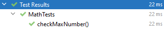
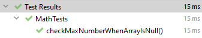
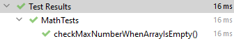
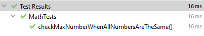
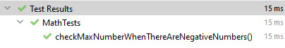

# Introduction to Test Driven Development (TDD)
The purpose of this project is to show step by step how TDD is done with a simple example in Java.

## Goal
Create a function that returns the highest number in a given array using Test Driven Development.

#### Example:

In the example below, 9 is the highest number in the array.
```
{1,3,9,5} -> 9
```

### How to run the tests
- cd to the project root folder in the command line
- ``mvn test``

## Activity 1 - Create first test
Following the Red -> Green -> Refactor pattern, create your first test for the project requirements. 

### Exercise 1.1 Create a failing test
Create a failing test for the function that returns the highest number in the given array.

**Solution:** The *checkMaxNumber* test  and the *Math* class were created, but the test is failing.  
```
public class MathTests {
    @Test
    public void checkMaxNumber() {
        //Arrange
        int[] input = new int[]{1, 3, 9, 5};

        //Act
        Integer actual = Math.maxNumber(input);

        //Assert
        assertEquals(9, actual);
    }
}

public class Math {
    static Integer maxNumber(int[] array) {
        return 0;
    }
}
```

**Output:**
```
org.opentest4j.AssertionFailedError: 
Expected :7
Actual   :0
```

### Exercise 1.2 Pass the failing test
Add the code to pass (make it Green) the failing test in Exercise 1.1.

**Solution:** The *maxNumber* method was updated to pass the test.

```
static Integer maxNumber(int[] array) {
        int maxNumber = array[0];

        for (int i = 1; i < array.length; i++) {
            if (array[i] > maxNumber) {
                maxNumber = array[i];
            }
        }

        return maxNumber;
    }
```

**Output:**



### Exercise 1.3 Refactor the code
Find a way to refactor the code in the maxNumber method to make it simple. Make sure the test is still Green after refactoring.

**Solution:** There is a *max* method in *Arrays* class that can be used instead

```
static Integer maxNumber(int[] array) {
        return Arrays.stream(array).max().getAsInt();
    }
```

**Output:**


---
## Activity 2 - Add some tests for edge case scenarios

### Exercise 2.1 Add a test when input array is Null
Add a test for the case when the input for the method *checkMaxNumber* is null.

#### Exercise 2.1.1 Create a failing test
Create a failing test for the scenario in Exercise 2.1.  

**Solution:** The following test was added to *MathTests* class.

```
@Test
public void checkMaxNumberWhenArrayIsNull()
{
    //Arrange
    int[] input = null;

    //Act
    Integer actual = Math.maxNumber(input);

    //Assert
    assertEquals(0, actual);
}
```

**Output:** Test is failing due to a null pointer exception.

```
java.lang.NullPointerException: Cannot read the array length because "array" is null
```

#### Exercise 2.1.2 Pass the failing test
Update the code to pass the failing test for the scenario in Exercise 2.1.

**Solution:** A condition for checking null input was added to the *maxNumber* method. 

```
static Integer maxNumber(int[] array) {
    if (array == null) return 0;
    return Arrays.stream(array).max().getAsInt();
}
```

**Output:**



---
### Exercise 2.2 Add a test when input array is empty
Add a test for the case when the input for the method *checkMaxNumber* is an empty array.

#### Exercise 2.2.1 Create a failing test
Create a failing test for the scenario in Exercise 2.2.

**Solution:** The following test was added to *MathTests* class.

```
@Test
public void checkMaxNumberWhenArrayIsEmpty()
{
    //Arrange
    int[] input = new int[]{};

    //Act
    Integer actual = Math.maxNumber(input);

    //Assert
    assertEquals(0, actual);
}
```

**Output:** Test is failing due to a no such element exception.

```
java.util.NoSuchElementException: No value present
```

#### Exercise 2.2.2 Pass the failing test
Update the code to pass the failing test for the scenario in Exercise 2.2.

**Solution:** A condition to check when the array is empty was added to the *maxNumber* method.

```
static Integer maxNumber(int[] array) {
    if (array == null || array.length == 0) return 0;
    return Arrays.stream(array).max().getAsInt();
}
```

**Output:**




---
### Exercise 2.3 Add a test when all numbers in the array are the same
Add a test for the case when the input for the method *checkMaxNumber* is an array with all the same numbers.

**Solution:** The following test was added to *MathTests* class.

```
@Test
public void checkMaxNumberWhenAllNumbersAreTheSame()
{
    //Arrange
    int[] input = new int[]{6,6,6,6};

    //Act
    Integer actual = Math.maxNumber(input);

    //Assert
    assertEquals(6, actual);
}
```

**Output:** Test is passing with current code



---
### Exercise 2.4 Add a test when there are negative numbers in the array
Add a test for the case when the input for the method *checkMaxNumber* is an array with negative numbers.

**Solution:** The following test was added to *MathTests* class.

```
@Test
public void checkMaxNumberWhenThereAreNegativeNumbers() {
    //Arrange
    int[] input = new int[]{1, -1, 8, -5, 3};

    //Act
    Integer actual = Math.maxNumber(input);

    //Assert
    assertEquals(8, actual);
}
```

**Output:** Test is passing with current code



---
## Technology
This project was built using:
- Java version 17.0.2
- JUnit 5.8.2 for unit testing
- Apache Maven 3.8.5 as project manager
- Community Edition for the IntelliJ 2021.3.2 development environment.